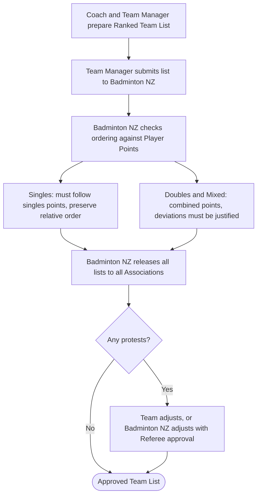
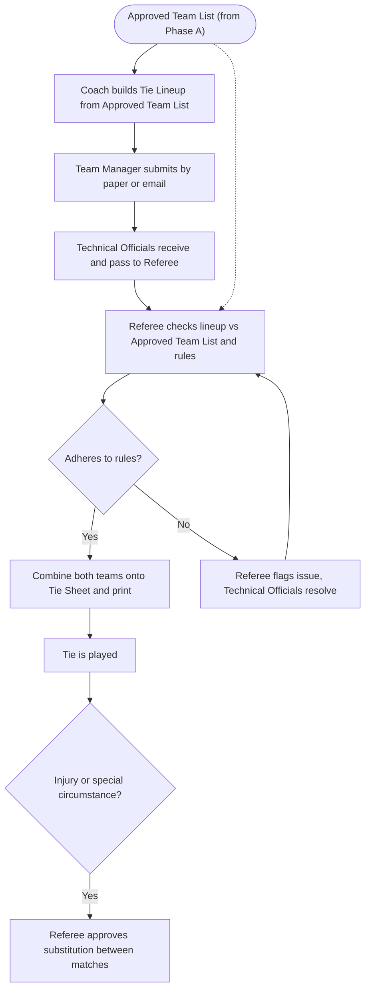

# Badminton New Zealand Team Events: Non-Technical Planning

This document consolidates the two non-technical planning documents for the Badminton New Zealand Team Events system into a single source. Part 1 is the Problem Definition (the problem space and the rules the process must enforce). Part 2 is the Requirements (user roles, user stories, and non-functional requirements). Content that appeared in both source documents is kept once, in the section whose job it is to own it, and referenced from the other.

Author: Vincent Tao.

## Versioning

| Date | Author | Rationale |
| --- | --- | --- |
| 21 September 2026 | Vincent Tao | Problem Definition initial draft. |
| 22 September 2026 | Vincent Tao | Requirements initial draft. |

---

## Part 1: Problem Definition

*A structured problem analysis and a single source of truth for the problem space.*

### Terminology

Domain terms are defined in [glossary.md](glossary.md).

### Executive Summary

Badminton NZ runs Team Events using a manual, paper-based process to submit and check Ranked Team Lists and Tie Lineups. Checking is repeated for every Team and Tie, placing time pressure on the Referee and Technical Officials and creating opportunities for errors. There is no digital system for submission or automated checking.

### Problem Context

Team Events differ from individual events. Associations enter one or more Teams, and Teams meet in Ties. Within a Tie, players compete at ranked Positions across Singles, Doubles, and Mixed Doubles.

Team ranking order is set by Player Points, which Badminton NZ maintains and updates regularly. Some players have no Player Points.

Checking exists to keep the order fair, so a Team cannot play a stronger player or pair below a weaker one.

### Stakeholders

- **Coach.** Sets the ranking order and places unranked players to create the Ranked Team List and builds each Tie Lineup. Passes the Ranked Team List and Tie Lineups to the Team Manager.
- **Team Manager.** Submits the Ranked Team List and each Tie Lineup to Badminton NZ by paper or email.
- **Badminton NZ (Technical Officials).** Receive submissions, release Ranked Team Lists to all Associations, handle protests, and resolve issues during the tournament.
- **Referee.** Checks Ranked Team Lists against Player Points and Tie Lineups against the Approved Team List. Approves protest adjustments and substitutions.
- **Other Associations.** Review each other's Ranked Team Lists and may lodge protests.
- **Players / Pairs.** The people named on the lists.

### Current State

#### Phase A (a few weeks before the tournament)

- The Coach and Team Manager prepare the Ranked Team List. The Team Manager submits it to Badminton NZ.
- Badminton NZ checks the order against Player Points.
- Badminton NZ releases all Ranked Team Lists to every Association.
- Associations review each other's lists and may lodge protests.
- Badminton NZ resolves protests by having the Team adjust the list or adjusting it with Referee approval.
- The result is the Approved Team List.

#### Phase B (during the tournament, one to two hours before each Tie)

- The Coach builds the Tie Lineup from the Approved Team List and passes it to the Team Manager.
- The Team Manager submits it by paper or email.
- The Technical Officials receive it and pass it to the Referee.
- The Referee checks the Tie Lineup against the Approved Team List and the rules.
- If it does not match, the Referee identifies the problem by hand, and the Technical Officials resolve it.
- If it is valid, both Teams' lineups are entered on a Tie Sheet and printed.
- During the Tie, a substitution is allowed only for a special reason, such as injury, and the Referee must approve it.

### Operational Characteristics

- Ties within a tournament often run in parallel.
- Tournaments also run back-to-back, so at any time, one tournament can be in Phase A and another in Phase B.
- Ties sometimes run past their intended window. When a Tie overruns, the next Tie's lineup can be submitted late, which pushes back the lineups after it. This is a normal part of running a tournament, not a failure.

### Current State Workflow

The two flowcharts below restate the current manual process for Phase A and Phase B. The load-bearing facts are also held in prose under Current State above and in [rules.md](rules.md), so these diagrams are a visual aid rather than the only record.

**Phase A**

**Phase B**

The dashed arrow shows the Approved Team List being used as the reference the Referee checks each Tie Lineup against.

### Rules the Process Must Enforce

The domain rules the process and the system must enforce are stated as testable statements in [rules.md](rules.md).

### Problem Statement

Every Ranked Team List and Tie Lineup is checked by hand against Player Points, the Approved Team List, and the tournament rules, and other Associations can protest a list before the tournament. The work passes through several handoffs and is heaviest in the one to two-hour window before a Tie. This manual checking is what makes the process slow, ties up the Referee and Technical Officials, and lets ordering or lineup errors through.

### Causes and Contributing Factors

- **No digital system.** Submission, checking, and output are all manual, with some stages being paper-based.
- Checking means comparing the submission, Player Points, and the Approved Team List by hand.
- Several handoffs: Coach to Team Manager to Technical Officials to Referee.
- Mixed submission channels: handwritten paper or email.
- **Complex rules.** Singles ordering, justified Doubles flexibility, one match per Event, substitutions, and a Tie Format that changes by tournament all have to be checked by a person.

### Impacts

- **Time.** The pre-Tie window is tight, so slow checking can hold up the start of a Tie.
- **Workload.** Repetitive checking ties up the Referee and Technical Officials, who are also running the event.
- **Accuracy.** Manual checking can approve an invalid ordering or lineup.
- **Auditability.** Paper output is hard to search, reuse, or review after the fact.
- **Fairness.** An approved ordering or lineup error can change a Tie's result.

### Constraints and Dependencies

#### Constraints

- Ordering rules are set by Badminton NZ and tied to Player Points.
- Unranked player placement is a judgment call, so part of the check cannot be automated.
- Doubles and Mixed ordering allows justified changes, so it needs judgement, not just a points comparison.
- The Phase B window of one to two hours before a Tie limits how long checking can take.
- Tie Format changes by tournament, so the process cannot assume fixed numbers of matches.
- Ties run in parallel, and tournaments overlap in different phases, so validation is not one item at a time.
- Ties can overrun, so submission and checking times shift during the day and are not necessarily fixed.

#### Dependencies

- Current Player Points are needed to check the order.
- The Approved Team List must exist before any Phase B check, so Phase B depends on Phase A being finished, including protests.

### Assumptions and Open Questions

#### Assumptions

- The goal is to improve this process, not to change the competition rules.
- After Phase A, the Phase B check is mainly about matching the Approved Team List and the rules, not a fresh Player Points check.

#### Open Questions

- Whether Player Points are available digitally at the point of checking.
- How long does checking actually take, and how often do errors or protests occur?
- Whether time and manual effort are the main pain, or something else, such as accuracy or disputes.
- Once a Ranked Team List or Tie Lineup is submitted, can a Team resubmit or amend it before the deadline?

### Scope and Boundaries

#### In Scope

- Team Events with multiple Associations and Teams.
- Submitting and checking the Ranked Team List, including the protest round.
- Submitting and checking Tie Lineups, including substitutions.
- Producing the Tie Sheet.

#### Out of Scope or Adjacent

- The Player Points system itself. It is maintained separately and used as an input.
- Individual (non-team) events.
- Match scoring, results, draws, and scheduling.

---

## Part 2: Requirements

*Functional and non-functional requirements defining the system capabilities, user interactions, and conditions for acceptance.*

### User Roles

The system's actors are the people described under [Stakeholders](#stakeholders) above, treated here as access-controlled roles. Each role can do only what its role allows (see Access control under [Non-Functional Requirements](#non-functional-requirements)). Coach, Team Manager, Technical Officials, Referee, and Association map directly to the stakeholders. One role is specific to the system and has no equivalent in the current manual process:

- **System Administrator.** Oversees the whole system, views logs, manages users, and can step in when a role is blocked. Their actions are recorded like everyone else's.

### User Stories

Priority follows MoSCoW: Must Have, Should Have, Could Have, Would Have.

#### Epic 1: Setup and Administration

##### US-01: Set up a tournament and its Tie Format

**Priority:** Must Have

As a Technical Official, I want to set up a tournament with its Tie Format and deadlines, so that submissions and checks follow the right structure.

**Acceptance criteria**

- Given a new tournament, when I set it up, I can define the Tie Format: how many Singles, Doubles, and Mixed matches each Tie has.
- Given the tournament, I can set the Ranked Team List submission and protest deadlines.
- Given that the Tie Format is set, it is used when Teams build Tie Lineups.

*Source: Rules, Selecting a Tie Lineup; Current State.*

##### US-02: Register teams, associations, and users

**Priority:** Must Have

As a Technical Official, I want to register the Associations, Teams, and users for a tournament so that the right people can take part in their respective roles.

**Acceptance criteria**

- Given a tournament, I can add the Associations and their Teams.
- Given a person, I can give them a role (Coach, Team Manager, Technical Official, Referee, Association, or System Administrator), and they can do only what their role allows.
- Given a Team, I can link its Coach and Team Manager.

*Source: Stakeholders; Non-Functional Requirements, access control.*

##### US-03: Load current Player Points

**Priority:** Must Have

As a Technical Official, I want to load the current Player Points so that all checks use the latest ranking.

**Acceptance criteria**

- Given the latest Player Points, when I load them, the system uses this version for checking.
- For a given player, the system displays their current Singles, Doubles, and Mixed points.
- Given a newer version is loaded, the system replaces the old one and records when it was updated.

*Source: Problem Context, Player Points; Constraints and Dependencies.*

##### US-32: Tournament dashboard

**Priority:** Should Have

As a Technical Official, I want a single dashboard for a tournament, so that I can see its Ties, submission status, protests, and approvals in one place while it runs.

**Acceptance criteria**

- Given a tournament, I can see all its Ties and their status, such as upcoming, in progress, or done.
- Given a tournament, I can see the submission and approval status of Ranked Team Lists and Tie Lineups, and what is still outstanding.
- Given a tournament, I can see open protests and substitutions that need attention.
- Given that Ties run in parallel, the dashboard shows the current state across all of them at once.

*Source: Operational Characteristics, parallel Ties; US-07 and US-17 (status views).*

#### Epic 2: Ranked Team List (Phase A)

##### US-04: Build a Ranked Team List

**Priority:** Must Have

As a Coach, I want to build our Ranked Team List by assigning players to Singles Positions and forming Doubles and Mixed pairs, so that the Team has an ordered list ready to submit.

**Acceptance criteria**

- Given that I assign a player to a Singles Position, the system records the player and their Singles Player Points.
- Given I form a Doubles or Mixed pair, the system records both players and their combined points.
- Given a player has no Player Points, the system lets me place them by hand.
- Given that I have not finished, the system saves the list as a draft.
- Given that I am building the list, I can reorder players and pairs.

*Source: Current State, Phase A; Rules, Ordering the Ranked Team List; US-03 (Player Points).*

##### US-05: See ordering warnings

**Priority:** Should Have

As a Coach, I want the system to flag any ordering that breaks the ranking rules, so that I can fix or justify it before submitting.

**Acceptance criteria**

- Given that the Singles order does not follow Singles Player Points, the system flags the Positions that break the relative order.
- Given a Doubles or Mixed pair is placed against combined points order, the system flags it and lets me add a justification.
- Given that ranked and unranked players are mixed, the system keeps the relative order of ranked players and does not flag unranked placements.

*Source: Rules, Ordering the Ranked Team List; US-03 (Player Points).*

##### US-06: Submit the Ranked Team List

**Priority:** Must Have

As a Team Manager, I want to submit our Ranked Team List before the deadline, so that it can be checked and approved.

**Acceptance criteria**

- Given a completed list, when I submit it, the system records it with a timestamp and marks it submitted.
- Given that the deadline has passed, when I try to submit, the system prevents it and tells me why.
- Given that I submitted more than once before the deadline, the system keeps all submissions and treats the latest as the one in effect.

*Source: Current State, Phase A; US-01 (deadlines).*

#### Epic 3: List Checking and Approval

##### US-07: View submitted lists

**Priority:** Should Have

As a Technical Official, I want to see all submitted Ranked Team Lists in one place, so that I can manage checking and approval.

**Acceptance criteria**

- Given that Teams have submitted, the system shows each Team's list and its submission time.
- Given that a Team has not submitted, the system shows it as outstanding.

*Source: Current State, Phase A.*

##### US-08: Automatic check against Player Points

**Priority:** Must Have

As a Referee, I want the system to check each Ranked Team List against Player Points, so that I only spend time on the exceptions.

**Acceptance criteria**

- Given a submitted list, the system confirms the Singles order follows Singles Player Points and flags any break in relative order.
- Given Doubles and Mixed pairs, the system flags any placed against combined points with no justification.
- Given that the check is done, I can approve the list or return it to the Team with the flagged issues.

*Source: Rules, Ordering; US-03 (Player Points); Problem Statement.*

##### US-09: Release lists to Associations

**Priority:** Must Have

As a Technical Official, I want to release all Ranked Team Lists to every Association, so that they can review and protest.

**Acceptance criteria**

- Given lists are ready, when I release them, every Association can view every Team's list.
- Given a list is released, an Association can view it but not edit it.

*Source: Rules, Protests.*

#### Epic 4: Protests

##### US-10: Review other Teams' lists

**Priority:** Must Have

As an Association, I want to review other Teams' Ranked Team Lists, so that I can check they follow the ranking rules.

**Acceptance criteria**

- Given lists are released, I can open another Team's list and see its order and any justifications.

*Source: Rules, Protests.*

##### US-11: Lodge a protest

**Priority:** Must Have

As an Association, I want to lodge a protest against a Team's list, so that an ordering that breaks the rules can be reviewed.

**Acceptance criteria**

- Given a released list, when I lodge a protest, the system records it against that list with my reason and a timestamp.
- Given that the protest window has closed, the system prevents me from protesting.

*Source: Rules, Protests; US-01 (protest deadline).*

##### US-12: Resolve a protest

**Priority:** Must Have

As a Technical Official, I want to resolve a protest by returning the list to the Team or adjusting it with Referee approval, so that the list can be finalised.

**Acceptance criteria**

- Given a protest, I can return the list to the Team to adjust or record an adjustment approved by the Referee.
- Given a resolution, the system keeps the original list, the change, and who approved it.

*Source: Rules, Protests.*

##### US-13: Approve the Ranked Team List

**Priority:** Must Have

As a Referee, I want to approve the final Ranked Team List, so that it becomes the Approved Team List for the tournament.

**Acceptance criteria**

- Given that the check has passed and the protests are resolved, when I approve the list, the system marks it as the Approved Team List.
- Given an Approved Team List, Tie Lineups in Phase B are checked against it.

*Source: Terminology, Approved Team List; Current State.*

#### Epic 5: Tie Lineup (Phase B)

##### US-14: Build a Tie Lineup

**Priority:** Must Have

As a Coach, I want to build a Tie Lineup for an upcoming Tie from our Approved Team List, so that the Team Manager can submit it.

**Acceptance criteria**

- Given the Tie Format, the system shows how many matches each Event needs.
- Given that I place players and pairs, the system only lets me choose from our Approved Team List.
- Given a player is already in another match of the same Event, the system prevents it, but allows the player across different Events.

*Source: Rules, Selecting a Tie Lineup; US-01 (Tie Format).*

##### US-15: Lineup ordering check

**Priority:** Should Have

As a Coach, I want the system to flag a lineup that breaks the relative ranking order within an Event, so that I can fix it before submitting.

**Acceptance criteria**

- Given players or pairs placed out of the approved relative order within an Event, the system flags it.

*Source: Rules, Selecting a Tie Lineup.*

##### US-16: Submit the Tie Lineup

**Priority:** Must Have

As a Team Manager, I want to submit the Tie Lineup for the upcoming Tie so that it can be checked before play.

**Acceptance criteria**

- Given a completed lineup, when I submit it, the system records it with a timestamp for that Tie.
- Given a Tie has overrun, when I submit late, the system still accepts the lineup and marks it late.
- Given that I submitted more than once before the deadline, the system keeps all submissions and treats the latest as the one in effect.

*Source: Current State, Phase B; Operational Characteristics; US-01 (deadlines).*

#### Epic 6: Lineup Checking and Tie Sheet

##### US-17: View incoming and outstanding Tie Lineups

**Priority:** Should Have

As a Technical Official, I want to see which Tie Lineups have arrived and which are still due, so that I can manage checking when Ties run in parallel.

**Acceptance criteria**

- Given upcoming Ties, the system shows which lineups have been submitted and which are still outstanding.
- Given a submitted lineup, I can see its Tie and submission time.

*Source: Current State, Phase B; Operational Characteristics.*

##### US-18: Check a Tie Lineup

**Priority:** Must Have

As a Referee, I want the system to check each Tie Lineup against the Approved Team List and the rules so I can approve valid lineups quickly and catch invalid ones.

**Acceptance criteria**

- Given a submitted lineup, the system confirms that every player and pair is from the Approved Team List.
- Given that a player appears in more than one match of the same Event, the system flags it.
- Given that the relative ranking order within an Event is broken, the system flags it.
- Given a valid lineup, I can approve it; given an invalid one, I can flag it for the Technical Officials to resolve.

*Source: Rules, Selecting a Tie Lineup; Problem Statement.*

##### US-19: Generate the Tie Sheet

**Priority:** Must Have

As a Referee, I want the system to combine both Teams' approved lineups into a Tie Sheet, so that both teams' lineups are shown together.

**Acceptance criteria**

- Given that both lineups are approved, when I generate the Tie Sheet, the system shows Team A against Team B, Position by Position, for each Event.
- Given a Tie Sheet, everyone at the event can view it, including players, managers, coaches, and spectators.

*Source: Current State, Phase B; Terminology, Tie Sheet.*

##### US-39: Share and print official records

**Priority:** Must Have

As a Team Manager, Coach, or Technical Official, I want to view, share, or print approved records so they reach the people who need them without being altered.

**Acceptance criteria**

- Given an Approved Team List, Tie Lineup, or Tie Sheet, I can view, share, or print it.
- Given a shared or printed copy, it shows the Team, Tie, Event, players or pairs, and the current status.
- Given a shared or printed copy, it is read-only and cannot be used to change the official record.

*Source: US-19 (Tie Sheet); Terminology, Tie Sheet.*

#### Epic 7: Substitutions

##### US-20: Request a substitution

**Priority:** Could Have

As a Team Manager, I want to request a substitution during a Tie for a special reason, such as injury, so that a teammate can take the affected later matches.

**Acceptance criteria**

- Given a Tie in progress, when I request a substitution, the system records the reason and the affected matches.
- Given that the replacement is already playing in that Event, the system prevents it.
- Given a match is in progress, the substitution applies only to later matches, not the current one.

*Source: Rules, Substitutions.*

##### US-21: Approve a substitution

**Priority:** Could Have

As a Referee, I want to approve or reject a substitution, so that only valid changes take effect.

**Acceptance criteria**

- Given a request, when I approve it, the system updates the affected matches and records the approval.
- Given that I reject it, the lineup stays unchanged.

*Source: Rules, Substitutions.*

#### Epic 8: Notifications

##### US-22: Status notifications

**Priority:** Could Have

As a Team Manager, I want to be told when our list or lineup is approved, returned, or protested, so that I can act quickly.

**Acceptance criteria**

- Given that my submission is approved, returned, or protested, the system notifies me of the reason.

*Source: Problem Statement, time pressure.*

##### US-37: Deadline reminders

**Priority:** Could Have

As a Team Manager, I want to be reminded as a submission deadline approaches, so that I do not miss it.

**Acceptance criteria**

- Given a Ranked Team List or Tie Lineup deadline is approaching, the system reminds me before it passes.
- Given that I have already submitted that item, I do not receive a reminder for it.

*Source: Problem Statement, time pressure; US-01 (deadlines).*

##### US-38: Notifications to officials

**Priority:** Could Have

As a Technical Official or Referee, I want to be notified when something requires my attention so I can act on it promptly.

**Acceptance criteria**

- Given that a Team submits a Ranked Team List or Tie Lineup, the relevant official is notified.
- Given that an Association lodges a protest, the relevant Technical Official is notified.
- Given a notification, it identifies the Team, Tie, or protest and what needs attention.

*Source: Complements US-22 (Team notifications); Operational requirement, time pressure.*

#### Epic 9: Accounts and Access

##### US-23: Sign in to an account

**Priority:** Must Have

As a user, I want to sign in to my own account, so that I can perform my role's tasks and no one else can act as me.

**Acceptance criteria**

- Given valid sign-in details, when I sign in, the system gives me access to my role's tasks only.
- Given that I am signed in as a Team Manager, I can make submissions only for my own Team.
- Given invalid sign-in details, the system refuses access.

*Source: Operational requirement; Non-Functional Requirements, access control and security.*

##### US-24: Recover account access

**Priority:** Should Have

As a user, I want to recover access if I forget my sign-in details, so that I am not locked out during a tournament.

**Acceptance criteria**

- Given that I have forgotten my sign-in details, when I request recovery, the system lets me regain access securely.
- Given a recovery request, the system records it.

*Source: Operational requirement.*

#### Epic 10: Administration and Oversight

##### US-25: View activity and audit logs

**Priority:** Should Have

As a System Administrator, I want to view activity and audit logs across all tournaments, so that I can see what happened and debug issues.

**Acceptance criteria**

- Given any tournament, I can view its activity and audit logs.
- Given a log entry, I can see who did what and when.

*Source: Operational requirement; Non-Functional Requirements, audit trail.*

##### US-26: Manage users and roles across Associations

**Priority:** Should Have

As a System Administrator, I want to view and manage users and roles across all Associations, so that I can fix access problems.

**Acceptance criteria**

- Given any user, I can view and change their role or account status.
- Given a change, the system records it against my account.

*Source: Operational requirement; US-02 (users and roles).*

##### US-27: Step in when a role is blocked

**Priority:** Could Have

As a System Administrator, I want to step in on a submission, check, or approval when a role is blocked or has made a mistake, so that the tournament can keep moving.

**Acceptance criteria**

- Given a stuck submission, check, or approval, I can act in place of the blocked role.
- Given any such action, the system records it against my account.

*Source: Operational requirement.*

##### US-28: Monitor system health

**Priority:** Would Have

As a System Administrator, I want to see the health and status of the system during a tournament, so that I can catch problems early.

**Acceptance criteria**

- Given that a tournament is running, I can see whether the system is healthy and working.

*Source: Operational requirement.*

#### Epic 11: Design and Usability

##### US-29: Simple, guided interface for non-technical users

**Priority:** Must Have

As a user who is not comfortable with technology, I want the screens and steps to be simple and guided, so that I can complete my tasks without training.

**Acceptance criteria**

- Given a core task such as submitting a list or lineup, a first-time user can complete it without training or help.
- Given any screen, the main action is clear, and the next step is obvious.
- Given text and controls, they are large and readable enough for older users.
- Given the design, it is tested with real users, including less technical ones, before release.
- Given a user increases the browser or system text size, the core workflows stay usable, and text does not overlap or get cut off.

*Source: Non-Functional Requirements, usability.*

##### US-30: Follow Badminton NZ branding

**Priority:** Could Have

As Badminton NZ, I want the interface to follow our branding and visual style, so that the system feels like an official Badminton NZ tool.

**Acceptance criteria**

- Given the interface, it uses Badminton NZ's colours, logo, and visual style in line with their brand guidelines.
- Given a new screen, it stays visually consistent with the rest of the system.

*Source: Client request.*

##### US-31: Works on the devices officials use

**Priority:** Must Have

As a user, I want the system to work on the device I use at the venue, so that I can submit and check on time without needing a specific computer.

**Acceptance criteria**

- Given a phone, tablet, or computer, I can complete my tasks, with the layout adapting to the screen size.
- Given a small screen, the main actions stay easy to find, tap, and read.

*Source: Non-Functional Requirements, usability; US-29 (simple interface).*

##### US-33: Autosave drafts

**Priority:** Should Have

As a Coach, I want my draft Ranked Team List or Tie Lineup to save automatically as I work, so that I do not lose it if I close the page or lose connection.

**Acceptance criteria**

- Given that I am building a Ranked Team List or Tie Lineup, the system saves my progress automatically as I make changes.
- Given I leave the page and return, my latest saved draft is restored.
- Given that I lose connection, the system keeps my last saved draft and does not discard my work.

*Source: Non-Functional Requirements, reliability; US-04 and US-14 (drafts).*

##### US-34: Explain validation warnings

**Priority:** Must Have

As a Coach, I want each warning to explain what is wrong and how to fix it, so that I can correct my list or lineup without needing an official.

**Acceptance criteria**

- Given the system flags an ordering or lineup issue, the warning names the affected Position, player, or pair.
- Given a warning, it states the rule that was broken in plain language.
- Given a warning, it tells me what to do to resolve it, such as reorder or add a justification.

*Source: US-29 (usability); US-05, US-08, US-15, US-18 (checks and flags).*

##### US-35: Clear submission outcome

**Priority:** Must Have

As a Team Manager, I want clear confirmation of whether my submission was received or failed, so that I know it went through and do not submit twice.

**Acceptance criteria**

- Given that I submit a Ranked Team List or Tie Lineup, the system confirms receipt with a timestamp.
- Given a submission fails, the system tells me clearly and keeps my draft so I can retry.
- Given I retry after an unclear result, the system does not create a duplicate, and the latest submission is the one in effect.

*Source: Non-Functional Requirements, reliability; US-06 and US-16 (submission and resubmission).*

##### US-36: Official status indicator

**Priority:** Must Have

As a user, I want each list and lineup to clearly show its current status, so that I always know which version is official.

**Acceptance criteria**

- Given a list or lineup, the system shows its status: Draft, Submitted, Returned, Protested, Approved, or Superseded.
- Given a newer submission replaces an earlier one, the earlier one is shown as superseded, and the latest is the one in effect.
- Given a shared or printed copy, it shows the same status.

*Source: US-06, US-13, US-16 (submission, approval, resubmission).*

### Non-Functional Requirements

- **Speed.** Checking a Ranked Team List or Tie Lineup returns a result in seconds, so it fits inside the one to two-hour pre-Tie window.
- **Concurrency.** The system handles many Ties at once and tournaments in different phases at the same time.
- **Late submissions.** The system accepts late Tie Lineups when a Tie overruns, without blocking later Ties.
- **Audit trail.** Every submission, check, protest, approval, substitution, and administrator action is recorded with who did it and when.
- **Access control.** Each role sees and does only what its role allows.
- **Security.** Each person signs in to their own account, and their credentials are protected in storage and in transit.
- **Privacy.** Player data is protected and used only for this process, in line with applicable privacy law such as the New Zealand Privacy Act 2020.
- **Usability.** The system is simple and intuitive for non-technical users, including senior officials with little tech experience, and it works under time pressure with little training.
- **Reliability.** The system is available during tournament hours, with a manual fallback if it is unavailable.

### Definition of Ready and Done

#### Ready to build

- The user and the value are clear.
- Acceptance criteria are written and testable.
- The rules the story depends on are confirmed.
- No blocking open question remains.

#### Done

- It meets its acceptance criteria.
- It enforces the relevant rules.
- Badminton NZ has reviewed and accepted it.
- Its actions appear in the audit trail where relevant.
