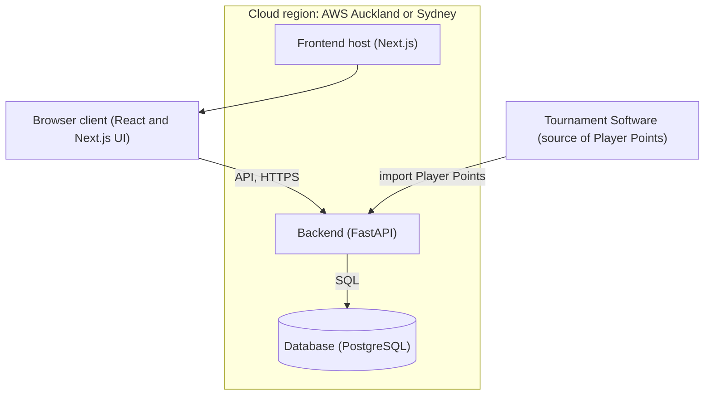
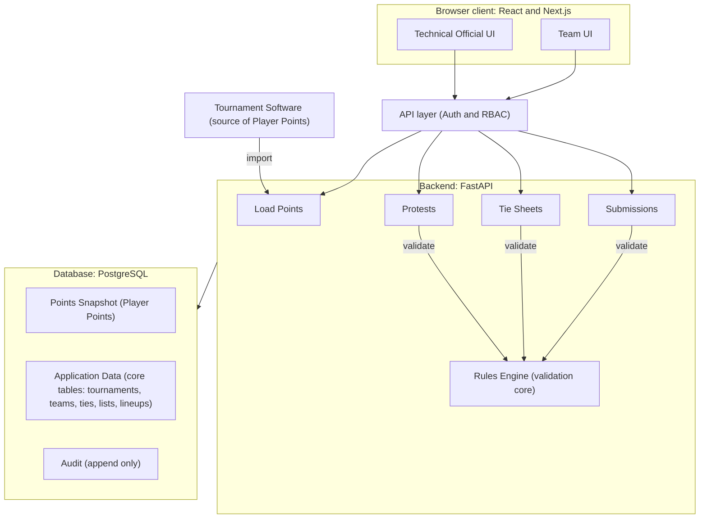
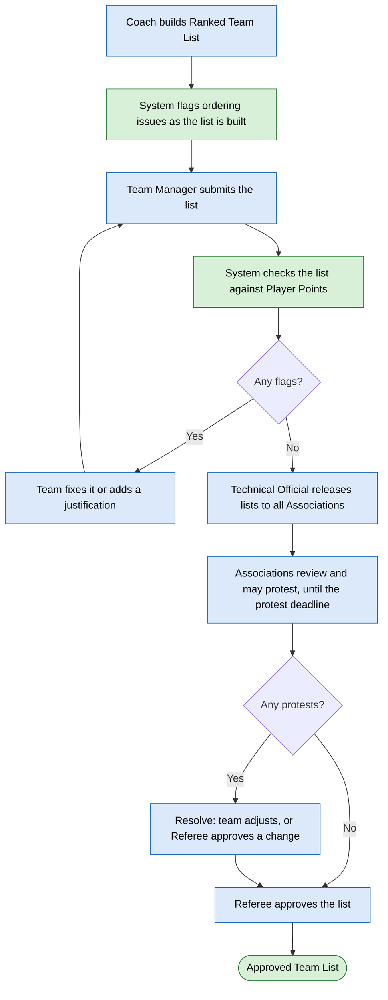
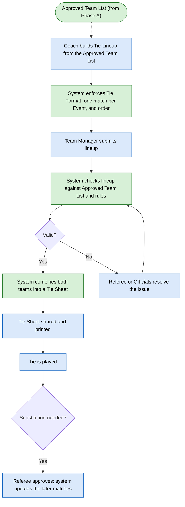
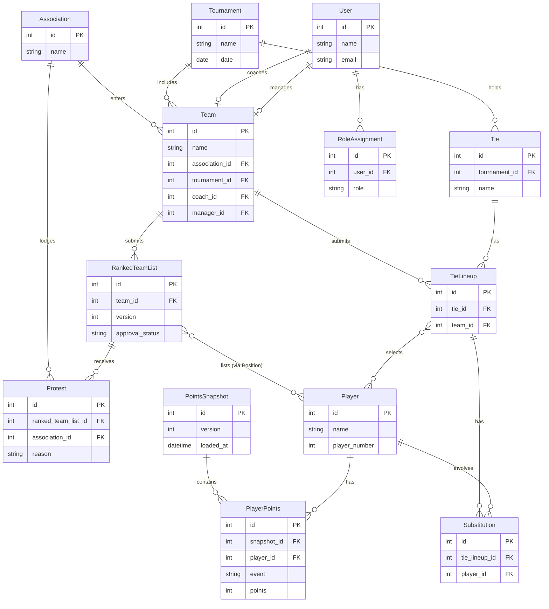

# Badminton New Zealand Team Events: Technical Planning

This document consolidates the three technical planning documents for the Badminton New Zealand Team Events system: the Solution Outline, the Technical Design, and the Implementation Details. It is organised by theme rather than by source document, because the three overlap heavily and a thematic layout removes that redundancy while keeping every fact once, in the section whose job it is to own it.

Diagram consolidation: the source documents contained eight diagrams. Five are reproduced here as Mermaid (System Architecture, System Design, the Entity Relationship Diagram, and the Future-State workflows for Phase A and Phase B). Three were dropped as redundant and their unique facts folded into prose or into the surviving diagrams: the End-to-End Overview (a lower-detail version of the Future-State workflows), the Conceptual Data Model (superseded by the ERD), and the simple technology stack diagram (covered by the Technology Stack table and the System Architecture diagram).

Author: Vincent Tao.

## Versioning

| Date | Author | Rationale |
| --- | --- | --- |
| 23 September 2026 | Vincent Tao | Solution Outline initial draft. |
| 28 September 2026 | Vincent Tao | Technical Design initial draft. |
| 28 September 2026 | Vincent Tao | Implementation Details initial draft. |

---

## Technology Stack

| Area | Technology | Reason |
| --- | --- | --- |
| Frontend | TypeScript, React, Next.js | Type safety for a data-heavy UI, with routing and form support. |
| Backend | Python, FastAPI | Strong request validation, readable business logic, and async support. |
| Database | PostgreSQL | Relational data model, strong integrity, transactions and auditability. |

Finer-grained technology choices (Pydantic, SQLModel, TanStack Query, the OpenAPI-generated client) appear in the sections that use them: Request and Response Models, Frontend Architecture, and API Design.

## System Architecture



- **Frontend:** Next.js application providing the browser-based user interface.
- **Backend:** FastAPI application providing the central API and business logic.
- **Database:** PostgreSQL as the primary application data store.
- **External Service:** Tournament Software provides Player Points.
- **Player Points:** imported and stored as versioned snapshots rather than read live during validation (see Major Technical Decisions, Versioned Player Points).
- **Deployment:** application components are deployed within a single cloud region (see Deployment). Automated database backups are enabled (see Monitoring and Reliability).

## System Design



### Major Components

- **Rules Engine:** centralised validation logic shared by live and official checks.
- **Submission System:** manages drafts, immutable submitted versions, approval and status transitions.
- **Player Points:** imports Player Points from Tournament Software and maintains versioned snapshots.
- **Audit System:** records significant system actions and changes.

### Data Flows

- **Player Points:** Tournament Software → Import/Load Points → Versioned Snapshot → Rules Engine.
- **Submission:** Browser → API → Authorisation → Rules Engine → Database Transaction → Version and Audit Record.

## Future-State Workflows

These are the target workflows the system implements, replacing the manual current-state process described in the non-technical document. The two phases are separated by a hard boundary: protests must close before the tournament starts, so Phase A is fully resolved into an Approved Team List before any Phase B lineup is checked.

In both diagrams, green nodes are automatic (performed by the system) and blue nodes are manual (performed by a person).

### Phase A: Ranked Team List

Stage sequence: Draft → Live Check → Submit → Official Check → Release → Protest → Approve.



### Phase B: Tie Lineup

Stage sequence: Draft → Live Check → Submit → Official Check → Approve → Tie Sheet.

The dashed arrow shows the Approved Team List being carried over from Phase A as the input and reference for the lineup.



## Major Technical Decisions

- **Shared Rules Engine.** One pure rules engine powers both live and official validation, ensuring that users see the same rules during drafting as those applied during the official check. The specific rules it enforces are listed as testable statements in [rules.md](rules.md).
- **Versioned Player Points.** Player Points are stored as frozen, versioned snapshots, so validation uses a known, reproducible dataset rather than changing external data.
- **Immutable Submission History.** Submitted records are preserved as immutable versions rather than being overwritten, allowing previous submissions to be reviewed and audited.
- **Transactional Writes.** State changes and their corresponding audit records are committed in the same database transaction to prevent inconsistent history.
- **Server-Side Authorisation.** Role-based access control and team/association scope are enforced by the backend rather than relying on frontend restrictions.

## Database Design

### Entity Relationship Diagram

> **This ERD is a guideline, not a strict ruleset.** The project is in its initial stages, most schemas are still incomplete, and the ERD is expected to change as the build progresses. Changes are normal and expected; they should be flagged to and confirmed with the project owner (Vincent) when they happen.



### Notes and simplifications to confirm

The diagram reproduces the drawn ERD, with the deltas below reconciled against the intended schema. The authoritative schema is the SQLModel models and the Alembic migration; the attribute types shown here are indicative, and the concrete types (including whether identifiers are integer or UUID) are decided there.

Decisions and simplifications reflected in the diagram:

- Each entity also carries additional columns beyond those listed (the "..." in the source), such as timestamps.
- **Approved Team List is a state**, represented by `approval_status` on `RankedTeamList`, not a separate entity. This is consistent with the locked decision.
- **`version` is kept as an attribute** on submittable records. A team submits multiple Ranked Team List versions until one is approved, so each submission is a new row. Immutability is delivered by writing a new row per submission, not by mutating this field.
- **Each team has exactly one coach and one manager**, and a coach or manager handles at most one team, so those relationships are one-to-one.
- **Player Points use two tables.** `PointsSnapshot` is one row per import, holding `version` and `loaded_at`. `PlayerPoints` is one row per player per event within a snapshot, holding `snapshot_id`, `player_id`, `event` and `points`, ideally with a unique constraint on (`snapshot_id`, `player_id`, `event`). This keeps `version` and the load time in one place and lets "read the snapshot in force" be a query for the entries of the current snapshot. How the current snapshot is identified (the highest `version`, or an explicit `is_current` flag on `PointsSnapshot`) is still open.
- **The audit log is intentionally omitted** from the ERD because it references many entities. It is described under Security Implementation, Audit Logging.
- **Player to Ranked Team List and Player to Tie Lineup are the central relationships.** They are shown as many-to-many and resolve through a Position table (for the list) and lineup slots (for the lineup). Confirm these junctions land correctly in the schema.
- **Tie to Player is not a direct relationship.** A Tie relates to players through its Tie Lineups (a Tie has many Tie Lineups, and each Tie Lineup selects many players), so the Tie-to-player link is many-to-many via `TieLineup`.
- **There is no direct Player to Team link.** Team membership is declared by the Ranked Team List, so a player relates to a team through that list. Every team is expected to have a Ranked Team List, so the path exists indirectly. A direct `team_id` on Player could be added later if it proves better for querying rosters.

Open concerns to confirm:

- **Substitution player fields.** `Substitution` currently has a single `player_id`, but a substitution involves two players: the player being replaced and the replacement. Consider splitting into `out_player_id` and `in_player_id`, plus a way to record which later matches are affected.
- **Tie Lineup versioning and status.** `TieLineup` has no `version` or `approval_status`, unlike `RankedTeamList`, yet lineups are resubmitted (latest in effect) and approved, and carry a status (Draft, Submitted, Approved, Superseded). Consider adding `version` and a status field to `TieLineup` for consistency with the immutable submission history and the status indicator requirement.
- **Role scope.** `RoleAssignment` has only a `role` string with no scope reference, but Security describes team, association and tournament scoped access. Consider whether `RoleAssignment` needs a scope column (for example `association_id`, `team_id` or `tournament_id`) to express scoped roles such as an association reviewer or a tournament official.

## API Design

- REST over HTTPS using FastAPI, served under a `/v1` prefix.
- A draft is autosaved, live checks do not persist changes, and submission creates an immutable version and performs the official validation.
- The setup step creates an empty Ranked Team List or Tie Lineup record, so a draft always has an ID to attach to.

### Endpoints

#### Authentication

| Method | Endpoint | Purpose |
| --- | --- | --- |
| POST | `/v1/auth/login` | Sign in |
| POST | `/v1/auth/logout` | Sign out |
| POST | `/v1/auth/recover` | Request password recovery |
| POST | `/v1/auth/reset` | Reset password |

#### Tournament and Reference Data

| Method | Endpoint | Purpose |
| --- | --- | --- |
| GET, POST | `/v1/tournaments` | List/create tournaments |
| GET, PATCH | `/v1/tournaments/{id}` | View/update tournament |
| GET | `/v1/tournaments/{id}/dashboard` | Tournament dashboard |
| CRUD | `/v1/associations` | Manage associations |
| CRUD | `/v1/teams` | Manage teams |
| CRUD | `/v1/users` | Manage users |
| CRUD | `/v1/role-assignments` | Manage role assignments |
| GET | `/v1/players` | Retrieve players |
| POST | `/v1/points/snapshots` | Load Player Points |
| GET | `/v1/points/snapshots/{id}` | Retrieve a snapshot |

#### Phase A: Ranked Team List

| Method | Endpoint | Purpose |
| --- | --- | --- |
| GET, PUT | `/v1/ranked-team-lists/{id}/draft` | Retrieve/update draft |
| POST | `/v1/ranked-team-lists/{id}/check` | Run live validation |
| POST | `/v1/ranked-team-lists/{id}/submit` | Submit and run official validation |
| POST | `/v1/ranked-team-lists/{id}/release` | Release the submitted list |
| POST | `/v1/ranked-team-lists/{id}/approve` | Approve list |
| POST | `/v1/ranked-team-lists/{id}/protests` | Lodge protest |
| POST | `/v1/protests/{id}/resolve` | Resolve protest |

#### Phase B: Tie Lineup

| Method | Endpoint | Purpose |
| --- | --- | --- |
| GET, PUT | `/v1/tie-lineups/{id}/draft` | Retrieve/update draft |
| POST | `/v1/tie-lineups/{id}/check` | Run live validation |
| POST | `/v1/tie-lineups/{id}/submit` | Submit and run official validation |
| POST | `/v1/tie-lineups/{id}/approve` | Approve lineup |
| GET | `/v1/ties/{id}/tie-sheet` | Retrieve Tie Sheet |
| POST | `/v1/tie-lineups/{id}/substitutions` | Request substitution |
| POST | `/v1/substitutions/{id}/approve` | Approve substitution |

#### Other

| Method | Endpoint | Purpose |
| --- | --- | --- |
| GET | `/v1/tournaments/{id}/audit` | Retrieve audit history |
| WS | `/v1/tournaments/{id}/stream` | Real-time status updates |

### Request and Response Models

- All request and response bodies use typed Pydantic models.
- The frontend client is generated from the FastAPI OpenAPI schema.

### Validation Results

Live checks and official checks use a shared validation-result structure. Findings identify the affected location, the rule, and the corrective action.

Passing check:

```json
{
  "ok": true,
  "findings": []
}
```

Failing check:

```json
{
  "ok": false,
  "findings": [
    {
      "severity": "block",
      "location": {
        "event": "singles",
        "position": 2
      },
      "rule": "Singles order must follow Singles points",
      "message": "Position 2 outranks position 1 by points",
      "how_to_fix": "Swap positions 1 and 2"
    }
  ]
}
```

### Error Handling

- The API uses a consistent error response format and standard HTTP status codes.
- Domain validation failures are returned as structured validation results rather than API errors.
- Submission conflicts and deadline violations return `409 Conflict`.
- Submissions carry an idempotency key, so a retry after an unclear result returns the original outcome rather than creating a second version.

## Frontend Architecture

### Routes

The application uses the Next.js App Router with role-protected routes.

| Area | Route |
| --- | --- |
| Authentication | `/login`, `/recover`, `/reset` |
| Tournament, Dashboard | `/tournaments`, `/tournaments/[id]` |
| Ranked Team List | `/tournaments/[id]/lists/[teamId]` |
| Tie Lineup | `/tournaments/[id]/ties/[tieId]/lineup/[teamId]` |
| Review and Protest | `/tournaments/[id]/lists` |
| Tie Sheet | `/ties/[tieId]/sheet` |
| Administration | `/admin` |

### Component Structure

The frontend is organised into feature modules: Tournaments, Ranked Team Lists, Tie Lineups, Protests, and Administration. The Ranked Team List and Tie Lineup builders share reusable components for slot editing, validation findings, and submission status.

### State Management

- **Server state:** TanStack Query for API data, caching and refetching.
- **Local state:** React state for builder interactions.
- **Draft persistence:** drafts autosave to the backend and are mirrored locally to reduce data loss during connection interruptions.
- **Authentication state:** derived from the server-side session cookie.

### API Integration

- A typed client is generated from the FastAPI OpenAPI schema.
- All API reads and mutations use the generated client through TanStack Query.
- Live validation is triggered with a debounced request as the user edits a list or lineup.

## Security Implementation

### Authentication

- Email/password authentication.
- Passwords are stored using a strong password hash such as Argon2id.
- Sessions are stored in httpOnly, Secure, SameSite cookies.
- Password recovery uses time-limited links.
- All traffic uses HTTPS/TLS.

### Authorisation

- RBAC with team, association and tournament scoping.
- Authorisation is enforced server-side on every protected request.
- Administrative overrides are recorded in the audit log.
- The audit log is append-only, so records cannot be altered after the fact.

### Audit Logging

The audit log records significant business actions rather than individual API requests or endpoints. The following actions are recorded:

- **Submission:** a Ranked Team List or Tie Lineup is submitted, including who submitted it.
- **Release:** a Ranked Team List is released to associations.
- **Protest:** a protest is lodged or resolved, including the responsible user.
- **Approval:** a Ranked Team List or Tie Lineup is approved, including who approved it.
- **Substitution:** a substitution is requested or approved, including the responsible users.
- **Player Points:** a Player Points snapshot is loaded and identified when it becomes the current snapshot.
- **Administrative Override:** an administrative override or step-in is performed, including the administrator.
- **Access Changes:** user accounts and role assignments are created, modified, or removed, including the user who made the change.

Audit records are append-only and include the actor, action, affected entity, timestamp and relevant context. They are written in the same database transaction as the associated state change, where applicable (see Major Technical Decisions, Transactional Writes).

### Validation

Validation occurs at two levels:

- **Request validation:** Pydantic validates request structure and types.
- **Domain validation:** the rules engine validates business rules against the Player Points snapshot.

No client-side validation is trusted as a security boundary.

### API Data Security

- Secrets stored outside the source code.
- Least-privilege database credentials.
- Parameterised database queries through the ORM.
- CSRF protection for cookie-based authentication.
- Rate limiting on authentication endpoints.
- Minimal collection and storage of player data.
- Dependencies regularly scanned for known vulnerabilities.
- Player data is stored in a New Zealand or Australian region, chosen to meet NZ Privacy Act 2020 residency requirements.

## Deployment

### Environments

Local → Staging → Production.

- **Local:** Docker Compose provides the local web application, API and PostgreSQL services.
- **Staging:** used for integration testing and testing with officials before tournaments.
- **Production:** hosts the application and database in the selected cloud region.

### CI/CD

The deployment pipeline should:

1. Run automated tests.
2. Run linting/type checks.
3. Build the application.
4. Take a database backup.
5. Apply database migrations.
6. Deploy to the target environment.

## Monitoring and Reliability

### Monitoring

- Application health endpoint.
- Platform and infrastructure metrics.
- Error monitoring and alerts.
- Structured application logs.
- Monitoring during tournament operation.

### Backups

- Automated database backups.
- Point-in-time recovery.
- Periodic restore testing.

### Failure Handling

A manual process is maintained as a fallback if the system becomes unavailable during a tournament.

## Testing

### Unit Testing

The rules engine receives comprehensive unit tests covering the individual domain rules and edge cases.

### Integration Testing

Tests cover API endpoints, database operations, authentication and authorisation, submission/versioning workflows, and Player Points ingestion.

### End-to-End Testing

Tests cover the primary user workflows: Ranked Team List from draft to approval, the protest workflow, Tie Lineup from draft to approval, Tie Sheet generation, and the substitution workflow.

### User Acceptance Testing

The complete system is tested with tournament officials in staging before production deployment.

## Implementation Plan

Development is dependency-ordered so that the core domain logic is established before the UI is built around it.

### Milestones

| Milestone | Deliverable |
| --- | --- |
| M1: Foundation | Repositories, local database, CI, schema and migrations, the rules engine, and tournament setup and sign-in. |
| M2: Phase A E2E | Ranked Team List end-to-end: building, live checks, submission, release, protest and approval, plus the shared builder and usability foundation. |
| M3: Phase B E2E | Tie Lineup end-to-end, including approval, Tie Sheet and substitutions. |
| M4: Hardening | Security, testing, monitoring, reliability, backups, and staging testing. |
| M5: Deployment and Production | Production launch, deployment, final user acceptance testing and manual fallback. |

### External Dependencies

The following dependencies are outside the core application build and may affect implementation decisions and milestone completion:

- **Player Points format:** confirm how Player Points are provided by the Tournament Software (for example, CSV export, file export, or API). This determines the ingestion approach for M1 to M2.
- **UI/UX validation:** complete a light UI/UX review of the Ranked Team List and Tie Lineup builders before their respective frontend milestones (M2 to M3).
- **Account provisioning:** confirm whether Badminton NZ creates user accounts or associations self-register. This determines the account and access-control implementation for M2.
- **Data residency:** confirm whether player data must be stored in New Zealand. This determines the cloud region and deployment configuration required for M5.
